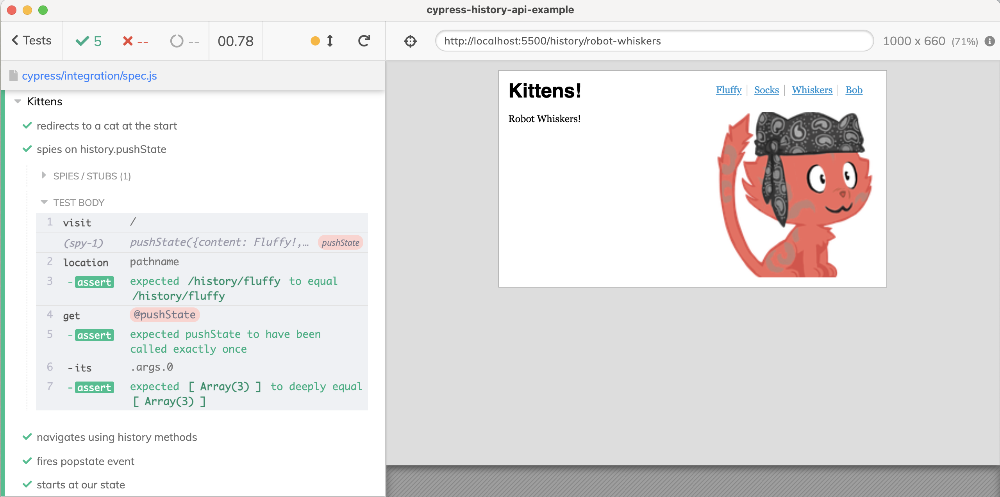

# cypress-history-api-example

> Testing the application that uses browser History API

Read the blog post [Cypress History API Example](https://glebbahmutov.com/blog/cypress-history-api-example/)

See the [spec.js](./cypress/integration/spec.js)

The demo application in the [public](./public) folder comes from this [html5doctor](http://html5doctor.com/demos/history/) demo, described in [History API](http://html5doctor.com/history-api/) blog post.
